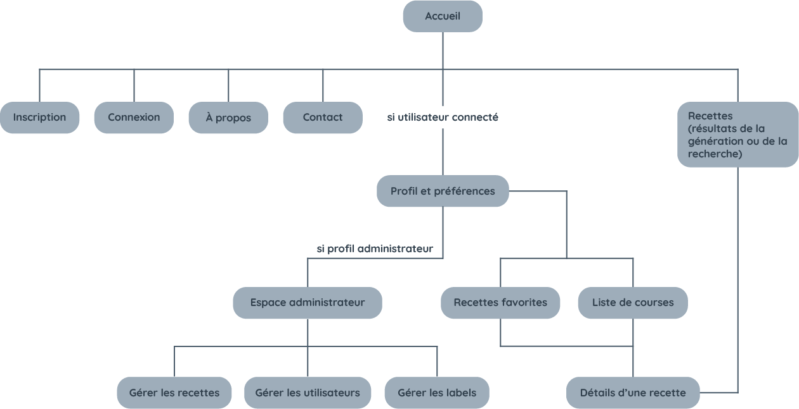

<h1 align="center">
O'Fourneaux
</h1>

Quand on a un emploi du temps chargé, qu'on commence une formation intensive de 5 mois, qu'on est parent, ou que l'on fait face à toute autre contrainte du quotidien, il est plus difficile de trouver le temps de réfléchir à ses repas. C'est pourquoi nous vous présentons notre application génératrice de recettes, qui vous permettra d'être plus serein et plus organisé jour après jour !

## Objectif

Nous souhaitons proposer une solution complète pour organiser ses repas, ses courses et ses recettes de cuisine : un générateur de recettes avec liste de courses. Notre but est de présenter une première version simple et fonctionnelle de cette application, en implémentant ses fonctionnalités les plus intéressantes.

## Public visé

L’application se veut très inclusive et personnalisable avec un large choix d’exigences alimentaires propres à chaque utilisateur.

## Accessibilité

L’application sera développée en responsive design, c’est-à-dire que l’affichage s'adapte en fonction de la taille d’écran et du terminal utilisé. Nous nous concentrerons sur deux types d’affichages : affichage mobile (pour les téléphones portables en mode portrait), et desktop (pour les ordinateurs, format paysage). 

## Fonctionnement

### Arborescence

